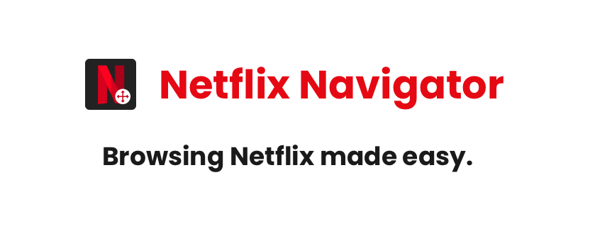
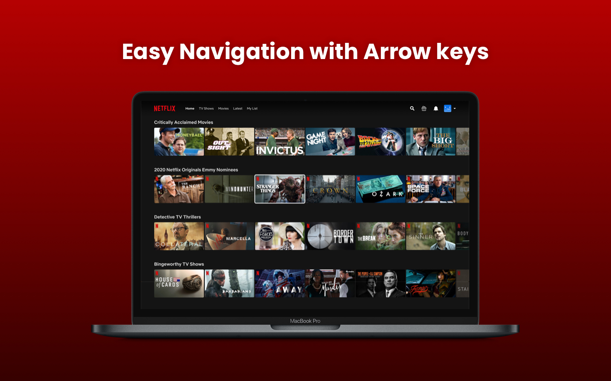
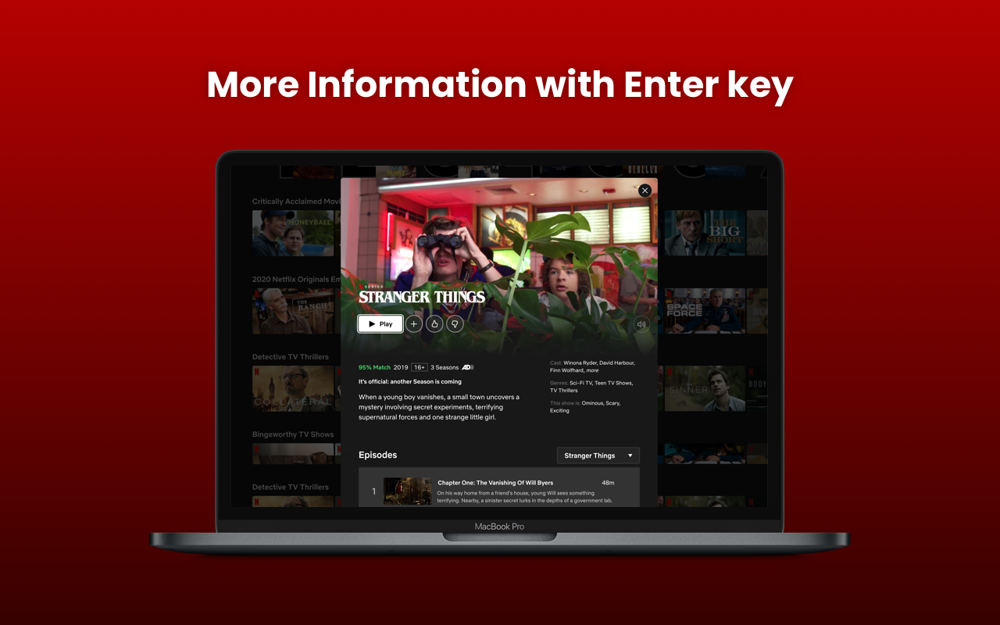
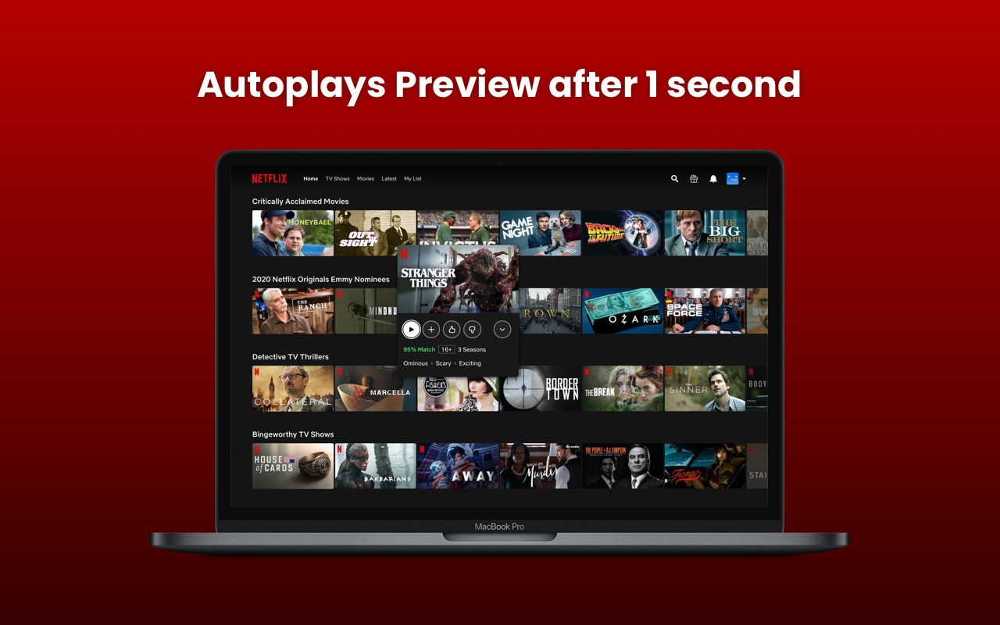

  

# Netflix Navigator

Browse unlimited Netflix TV Shows and Movies easily with your Keyboard Arrow Keys.

## Install

[**Chrome** extension](https://chrome.google.com/webstore/detail/netflix-navigator/kiikkoajobekfkpgaojoincnfombbaco)

## Features

**Easily browse Netflix TV Shows and Movies with keyboard arrow keys.** 
 

**See more information of a TV show and Movie by pressing Enter key.** 
 

**Preview video will automatically start after 1 second.** 
 

**Quickly search a TV show or Movie by pressing S key.** 
 

## Contribution

Suggestions and pull requests are welcomed!.

## Support

